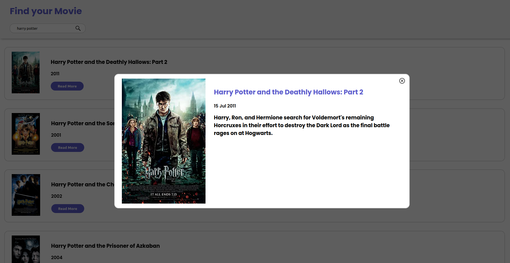

<h1 align="center">
   
  
   
Find you Movie   
</h1>
<h4 align="center">Recherche tes films préférés de manière dynamique grâce à l'API OMDb et l'intersection observer</h4>
 

## WEB version 🌐

Le site est en live ici 👉 [Find your Movie](https://guillaume-rygn.github.io/FindyourMovie/)

/!\ Pour utiliser le site merci de desactiver la protection de la page.

## Technologies utilisées ⚙️

Pour ce programme les technologies suivantes ont été utilisé :  

 
 
Le site est responsive.

## Crédit 🔗
[Guillaume Reygner](https://github.com/guillaume-rygn)
